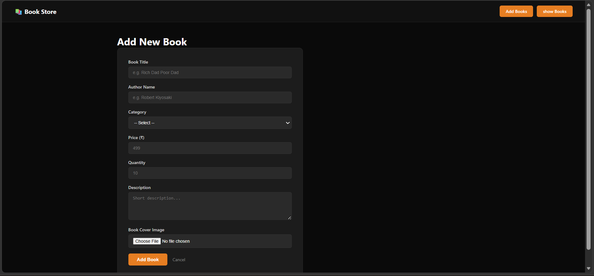
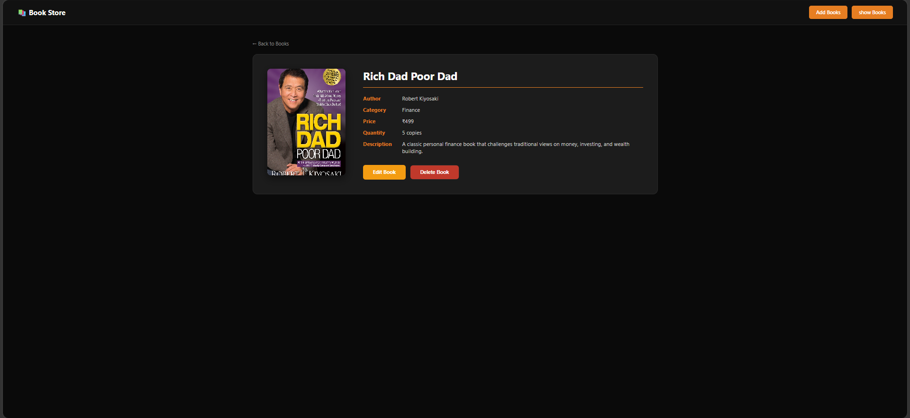
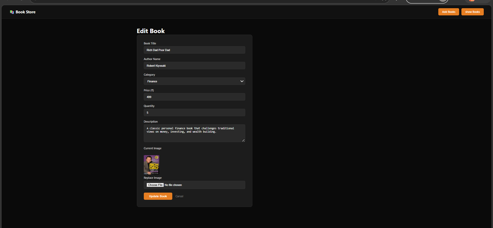

# 📚 BookStore Management System
## 📌 Project Overview

Book Store Management System is a web-based application built using Node.js, Express.js, MongoDB, and EJS. It allows users to perform complete CRUD operations on book records along with image upload functionality.

---

## 🚀 Features

* Add new books with details and image upload
* View all books in a structured card layout
* Edit and update book information
* Delete books from the database
* Upload and display book cover images
* Clean and responsive user interface
* MVC architecture implementation

---

## 🛠️ Technologies Used

* Node.js
* Express.js
* MongoDB (Compass / Local)
* Mongoose
* EJS Template Engine
* Multer (Image Upload)
* HTML, CSS

---

## 📁 Folder Structure

```
bookstore/
├── app.js
├── multerConfig.js
├── models/
│   └── Book.js
├── controllers/
│   └── bookController.js
├── routes/
│   └── bookRoutes.js
├── views/
│   ├── partials/
│   │   ├── header.ejs
│   │   └── footer.ejs
│   └── books/
│       ├── index.ejs
│       ├── add.ejs
│       └── edit.ejs
├── public/
│   └── css/style.css
└── uploads/

```

---

## ⚙️ Installation & Setup

1. Clone the repository

```
 git clone https://github.com/sahil-7878/Node-Js/tree/main/bookstore
```

2. Navigate to project folder

```
cd bookstore
```

3. Install dependencies

```
npm install
```

4. Start MongoDB (Local)

```
mongod
```

5. Run the project

```
npm start
```

6. Open in browser

```
http://localhost:8001
```

---

## 🗄️ Database Schema

Book Model:

```
title: String  
author: String  
category: String  
price: Number  
quantity: Number  
description: String  
image: String  
```

---

## 🔄 Project Flow

1. User opens the application
2. Adds a new book using form
3. Data is stored in MongoDB
4. Books are displayed on homepage
5. User can edit or delete books
6. Images are uploaded and stored in uploads folder

---
## output

   


## 👨‍💻 Author

Sahil Nerpgar

---


