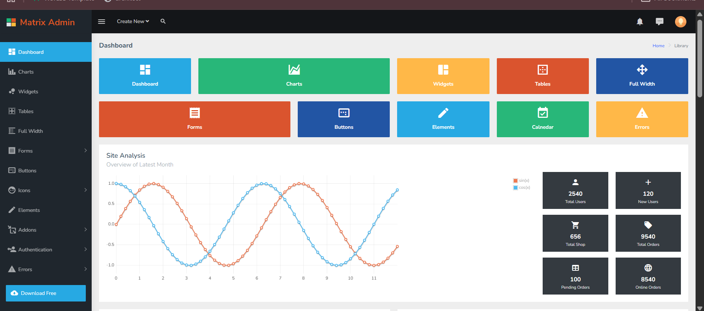
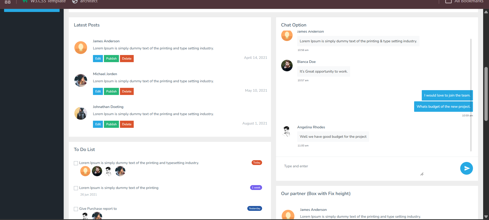
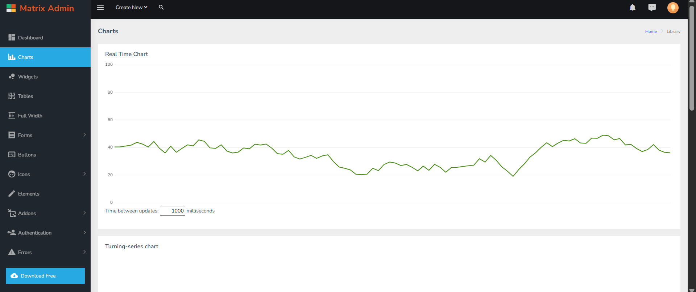

# 🚀 Admin Panel – HTML to Node.js (MVC)

✨ Convert a static HTML admin dashboard into a dynamic Node.js application using **Express** and **EJS templating**

---

## 📖 Overview

This project demonstrates how to convert a static HTML admin panel into a dynamic web application using:

* ⚙️ Node.js & Express
* 🧩 EJS Template Engine
* 🎯 MVC Architecture (basic structure)

The project keeps all static assets inside the `public` folder and renders dynamic views using EJS.

---

## 🛠️ Tech Stack

* Node.js
* Express.js
* EJS (Embedded JavaScript Templates)
* HTML, CSS, JavaScript

---

## 📂 Project Structure

```
html-to-ejs-master/
│
├── node_modules/
│
├── public/
│   └── assets/
│       ├── css/
│       ├── js/
│       ├── images/
│       ├── dist/
│       ├── html/     # Original static HTML files
│       └── src/
│
├── views/
│   └── index.ejs     # Converted EJS files
│
├── index.js          # Main server file
├── package.json
├── package-lock.json
├── README.md
└── .gitignore
```

---

## ⚡ Features

* ✅ Convert HTML templates into EJS
* ✅ Serve static files using Express
* ✅ Organized folder structure
* ✅ Easy to scale into full MVC
* ✅ Beginner-friendly project

---

## 🔧 Installation & Setup

### 1️⃣ Clone Repository

```bash
git clone https://github.com/your-username/html-to-ejs.git
cd html-to-ejs
```

---

### 2️⃣ Install Dependencies

```bash
npm install
```

---

### 3️⃣ Run Server

```bash
node index.js
```

Server will run at:

```
http://localhost:3000
```

---

## 🌐 Usage

* Open browser
* Visit: `http://localhost:3000`
* Your EJS page will render dynamically

---

### 3. Routing

Example route in `index.js`:

```js
app.get('/', (req, res) => {
    res.render('index');
});
```


---

## 📈 Future Improvements

* 🔐 Add authentication system
* 📊 Dynamic dashboard data
* 🧾 CRUD operations
* 🗄️ Database integration (MongoDB)
* 🎯 Full MVC implementation

---
##  output
  

---

## 📜 License

This project is created for **learning purposes only**.

---

## 👨‍💻 Author

**Sahil**

---

## ⭐ Support

If you like this project:

⭐ Star the repository
🍴 Fork it
📢 Share it

---

💡 *Happy Coding with Node.js!* 🚀
