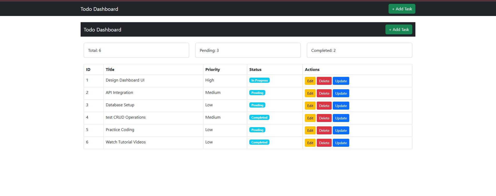
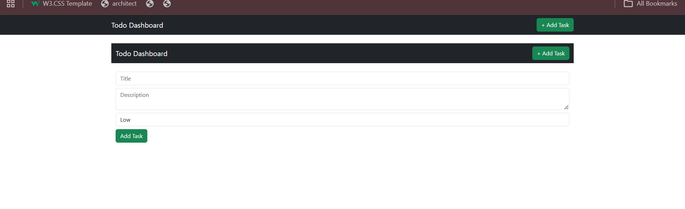

# 🚀 Real-Time Todo Management System

A dynamic and responsive Todo Management System built using **Node.js, Express.js, and EJS**. This application allows users to manage daily tasks efficiently with features like adding, editing, deleting, and tracking task progress in real time.

---

## 📖 Project Overview

This project simulates a real-world productivity system where users can:

* Add new tasks
* Edit existing tasks
* Delete tasks
* Track task status (Pending → In Progress → Completed)

It focuses on backend logic, UI structure, and CRUD operations.

---

## 🛠️ Tech Stack

* **Backend:** Node.js
* **Framework:** Express.js
* **Template Engine:** EJS
* **Frontend:** HTML, CSS, Bootstrap

---

## 📁 Project Structure

```
TodoApp
│── views
│   ├── partials
│   │   ├── header.ejs
│   │   ├── footer.ejs
│   │
│   ├── dashboard.ejs
│   ├── add-task.ejs
│   ├── edit-task.ejs
│
│── public
│   ├── css
│   │   └── style.css
│
│── app.js
│── package.json
```

---

## ✨ Features

* 📊 Dashboard with task statistics
* ➕ Add new tasks
* ✏️ Edit existing tasks
* ❌ Delete tasks
* 🔄 Update task status
* 🎨 Responsive UI using Bootstrap
* 🔖 Status badges (Pending, In Progress, Completed)

---

## 📌 Task Object Example

```json
{
  "id": 1,
  "title": "Prepare Report",
  "description": "Complete weekly project report",
  "priority": "High",
  "status": "Pending"
}
```

---

## ⚙️ Installation & Setup

### 1. Clone the repository

```
git clone https://github.com/your-username/todo-app.git
```

### 2. Navigate to project folder

```
cd todo-app
```

### 3. Install dependencies

```
npm install
```

### 4. Run the server

```
node app.js
```

### 5. Open in browser

```
http://localhost:3000
```

---

## 🎯 Usage

* Click **Add Task** to create a new task
* Use **Edit** button to modify task details
* Click **Delete** to remove task
* Use **Update Status** to change task progress

---

## 📸 Screenshots

* Dashboard Page
* Add Task Page
* Edit Task Page
* Task Status Update

(Add your screenshots here)

---

## 💡 Future Enhancements

* 🔐 User authentication (Login/Register)
* 🗄️ Database integration (MongoDB)
* 🌐 REST API support
* ⚡ Real-time updates using WebSockets

---

## 🏁 Conclusion

This project is a beginner-friendly implementation of a Todo Management System demonstrating core backend concepts, MVC structure, and dynamic UI rendering.

---
## outout
 


---
## 👨‍💻 Author

**Sahil Nerpagar**
MERN Stack Developer

---

## ⭐ Support

If you like this project, give it a ⭐ on GitHub!
